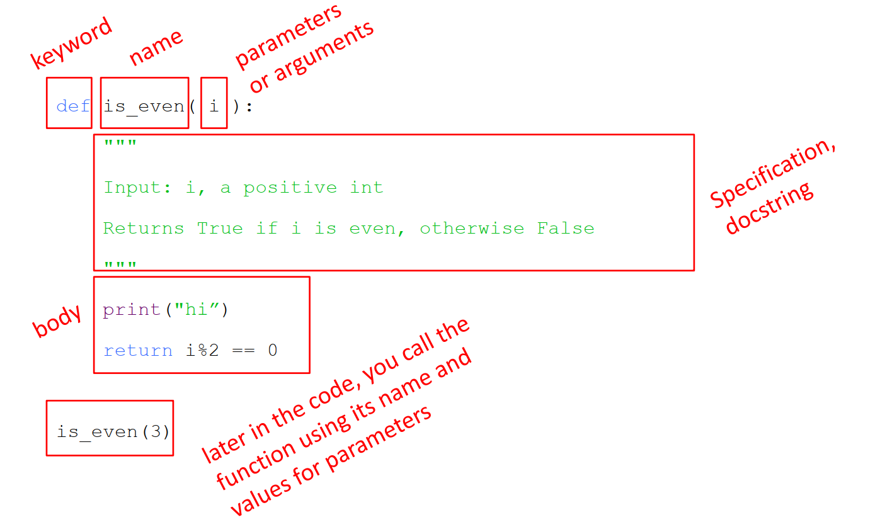

<!--more-->

## Lecture 1

* 这门课学什么？

  * 计算机思维模型
  * 通过计算机思维解决实际问题
  * 让计算机为你工作

* 计算机能做什么？

  * 计算
  * 记忆

* 计算机能做什么类型的计算？

  * 由语言自身内置的
  * 自己定义的

* 简单的计算就足够了吗？

  * 不够的，还需要好的算法，不然处理任务的时间会非常久。

* 有足够大的存储空间就可以了吗？

  * 不可以，不能只是用暴力或者预先计算，这样需要存储的东西和算力耗费太多了，需要聪明的算法来解决。

* 计算机计算是否有极限？

  * 是的，即使有好的算法，依旧有它的极限。
  * 一些问题过于复杂，当前的机器性能上无法计算。
  * 例子：
    * 准确预计特定小范围的天气情况
    * 破译密码
  * 还有一些是根本无法用计算机解决
  * 例子：Turing halt problem

* 你告诉计算机的知识有哪两类？

  * 陈述性知识
  * howto 类知识

* 什么是陈述性知识？

  * 陈述性知识就是对事实的描述，举个例子的话，就是我家门前有两棵树，一棵是枣树，另一棵也是枣树。

* 什么是howto类知识？

  * howto类知识就是如何做的步骤或方法的详细过程或流程。举个例子的话，就是把大象装进冰箱，打开冰箱门，把大象放进冰箱，关上冰箱门。

* 什么是算法？

  * 类似菜谱，有详细的步骤，有控制流程，做完停止。
  * 算法实际上是解决实际问题的方法。
  * 算法是一系列机械化的步骤，自动执行，执行完停止。

## Lecture 2

### 字符串语法

```python
# 用单引号或双引号括起来
name = 'nicokon'
say = "hi"

# 连接字符串
greeting = say + name

# 操作符号
'a'+'b'
3*'a'
len('abc')
'abc'[1]
'abc'[1:3]

# 输入 input,此处类型为string
input('Type a number...')
# 转化为int类型
int(input('Type a number...'))

# 输出
print(name)

# immutable
s = 'hello'
s[0] = 'y' # error
s = 'y' + s[1:len(s)] # is allowed
```

### 循环（loop）

* while
* `for <variable> in range(<num>)`
* range(start, stop, step)
* break
  * 立即退出它所在的循环
  * 跳出代码中的其余表达式
  * 只跳出最内层的循环

### 迭代（iteration）

* 例子：guess and check
* 穷举法

## Lecture 3

> 找近似解

### 二分搜索（bisection search）

* 搜索范围：N
* 最多搜索次数：log2N
* 例子：找平方根/立方根
* 适用范围：有序/单调的范围内搜索

### 浮点数和分数（floats and fractions）

* 例子：十进制转二进制
  
  ``` python
  ''' x decimal number
  r remainder'''
  r = x % 2
  x = x // 2
  # trick
  result = ''
  result = str(x%2)+result
  ```

* 浮点数的比较建议：用`abs(x-y) < small number` 而不是`x == y`

### 牛顿迭代法（Newton-Raphson）
  
* 寻找平方根近似值
  
  ```python
  guess = guess - ((guess**2-y)/2*guess)
  ```

## Lecture 4

> 好的程序员不看他的代码的数量，而是看代码的质量，实现了的功能的数量

### 分解和抽象

#### 什么叫做程序的分解和抽象？

以投影机为例，**抽象**就是一台投影机在外部看来只有输入和输出接口，使用的人**不需要知道里面具体是如何工作的**。**分解**就是多台投影机一起工作，完成巨大的图像，但分配给**一台投影仪的只是局部的一小部分**

应用在编写程序上，**分解**就是代码的模块化，有着自包含（self-contained）、分解代码（break up code）、可复用（reusable）、有组织性的（organized）、连贯的（coherent）特性。

分解的途径：function，class。

而抽象就是隐藏不需要、不用被看到的细节。

抽象的途径：function specification 或 docstrings

### 函数与作用域

